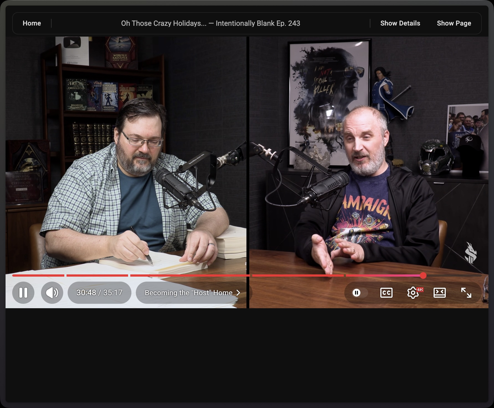
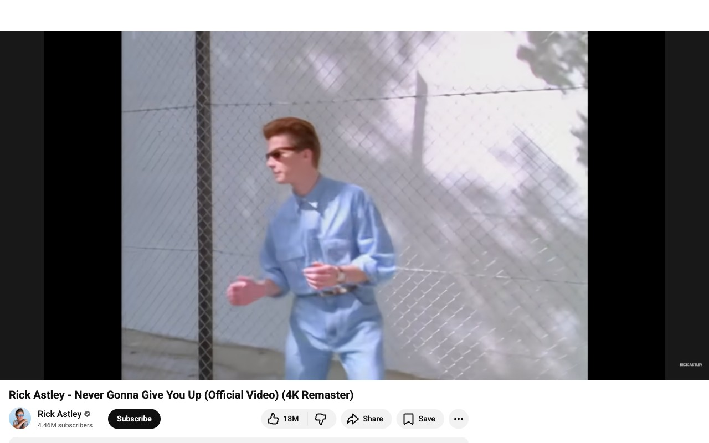
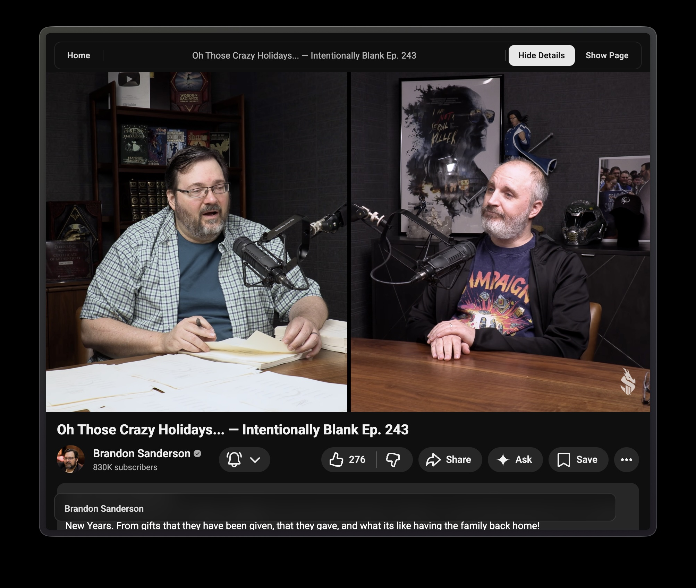

# qyt - YouTube Player Focus Mode (Chrome Extension)

A Chrome extension that hides non-player content on YouTube watch pages by default, leaving the video player as the main visible element.

## Features

- **Focus mode** (default): fullscreen player with everything else hidden
- **Details mode**: reveals description, playlist controls, and chapters while hiding recommendations and comments
- **Full page mode**: restores the normal YouTube layout
- Hides Shorts shelves/cards on the YouTube home page
- Shows video title overlay on mouse/keyboard/touch activity, then auto-hides
- In focus/details modes, a floating top bar provides `Home`, `Channel`, `Show Details`, and `Show Page` controls
- In full page mode, `Show Details` and `Hide Page` integrate directly into YouTube's native player controls

## Screenshots

**Focus mode (Default)** - player only, no distractions:

**Focus mode with controls** - appears on mouse activity, then auto-hides:

**Details mode** - description, playlist controls, and chapters visible:

**Details mode with controls**:

**Full page mode** - controls integrated into YouTube's native player bar:

## Project files

- `manifest.json` - Extension manifest (Manifest V3)
- `content.js` - YouTube page behavior and toggle button logic
- `styles.css` - Focus mode and button styles

## Load as an unpacked developer extension

1. Open Chrome and go to `chrome://extensions`.
2. Enable **Developer mode** (top-right toggle).
3. Click **Load unpacked**.
4. Select this project folder.
5. Open any YouTube video.
6. The page should open in focus mode by default.
7. Move the mouse to reveal controls, then toggle between modes.

## Notes

- YouTube is a single-page app; qyt re-applies focus mode when navigating between videos.
- To remove qyt, go back to `chrome://extensions` and disable or remove the extension.
- Generated with Opus 4.6 and GPT-5.3 Codex using Cursor
